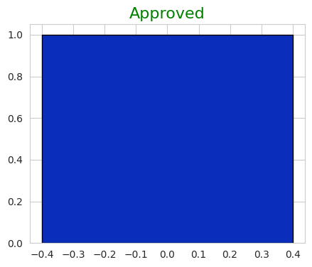

# ChromaCraft

ChromaCraft is a Python package for generating and visualizing distinguishable color palettes. It provides tools for generating color sets with specific criteria, such as minimum and maximum color differences. This package is particularly useful for data visualization and design tasks where a set of visually distinct colors is needed.

## Installation

To install you can simply use `pip`

```bash
pip install chroma-craft´´
```

# Usage

Import the ChromaCraft package and use its functions to generate and visualize color palettes.

```python
import chroma_craft as cc
import seaborn as sns

# Set the Seaborn style for better visualization
sns.set_style('whitegrid')

# Generate a list of distinguishable colors
n = 24  # Number of colors to generate
min_color_diff = 0.25  # Minimum color difference
max_color_diff = 1.2   # Maximum color difference
colors = cc.generate_distinguishable_colors(n, min_color_diff, max_color_diff, hexa=True)

# Plot the color palette
cc.plot_color_palette(colors)
```


```python
print(colors)
['#c6dd6d', '#51e3fb', '#6c8c98', '#80f79e', '#cd4e76', '#09fe8a', '#2e3c0c', '#17229b',
'#d6c1b1', '#82a243', '#843520', '#7a039f', '#21a371', '#d4c00d', '#7c90dd', '#537e02',
'#66495e', '#342147', '#ef7b43', '#b90d76', '#c39b7e', '#8adf15', '#1556cc', '#3bde54']
```

# Debug
Here's an example of how debug information is shown:

```python
import chroma_craft as cc
import seaborn as sns

# Set the Seaborn style for better visualization
sns.set_style('whitegrid')

# Number of colors to generate
n = 3

# Minimum and maximum color difference
min_color_diff = 0.25
max_color_diff = 1.2

# Generate a list of distinguishable colors
colors = cc.generate_distinguishable_colors(n, min_color_diff,
                                            max_color_diff, debug=True, hexa=False)

# Plot the color palette
cc.plot_color_palette(colors)
```




## Author

ChromaCraft was created by Felix. If you find this package useful or have any feedback, please feel free to reach out to croma_craft@auneria.com.

- GitHub: [Felix-Pedro](https://github.com/Felix-Pedro)
- LinkedIn: [Felix](https://www.linkedin.com/in/pedro-henrique-felix-gomes/)
